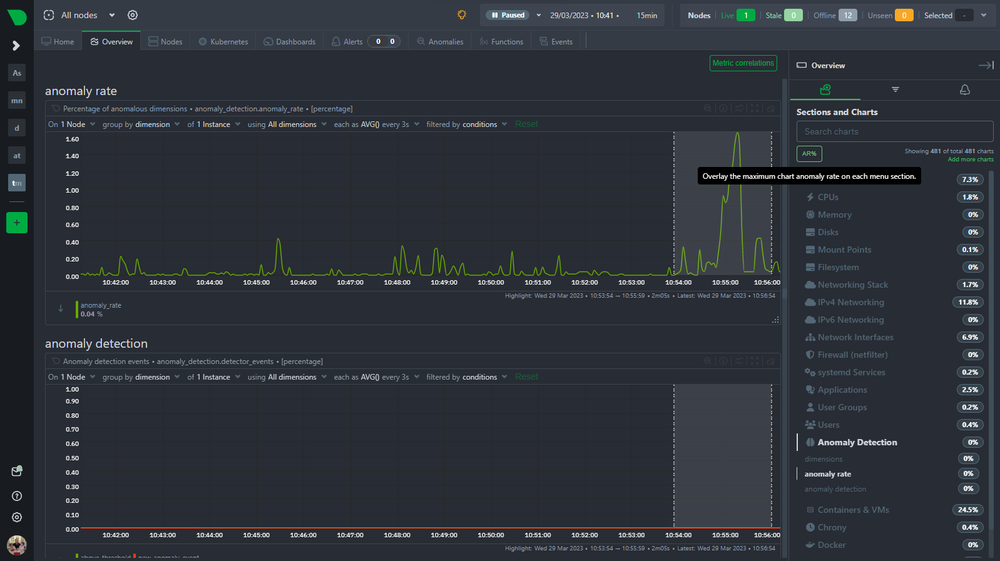
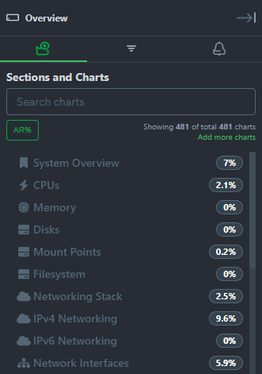

The menu (on the [overview or single node tab](https://learn.netdata.cloud/docs/getting-started/monitor-your-infrastructure/home-overview-and-single-node-view#overview-and-single-node-view)) now has an [anomaly rate](https://learn.netdata.cloud/docs/troubleshooting-and-machine-learning/machine-learning-ml-powered-anomaly-detection#anomaly-rate) button built into it that, for the entire visible window or a highlighted time range, shows the maximum chart anomaly rate within each section.

Read on to learn more about this new feature!

<!--truncate-->

## Wait, what is an anomaly rate?

Netdata is the only monitoring agent that natively (for every metric, with zero config and sane defaults) produces anomaly rates in addition to just collecting raw metrics.

This means that each time Netdata collects a raw metric value, it also calculates an [anomaly score](https://learn.netdata.cloud/docs/troubleshooting-and-machine-learning/machine-learning-ml-powered-anomaly-detection#anomaly-score) for that value. If the score is above a certain threshold, the value is considered an anomaly and the [`anomaly-bit`](https://learn.netdata.cloud/docs/troubleshooting-and-machine-learning/machine-learning-ml-powered-anomaly-detection#anomaly-bit) associated with that metric is set to 1 (anomalous). Otherwise, the `anomaly-bit` is set to 0 (normal). The [anomaly rate](https://learn.netdata.cloud/docs/troubleshooting-and-machine-learning/machine-learning-ml-powered-anomaly-detection#anomaly-rate) is the percentage of time that the `anomaly-bit` is set to 1 for any window of time and/or any group of metrics.

🚧 Note: If you'd like to dive deeper on how all this works there is a lot more detail in the [documentation](https://learn.netdata.cloud/docs/troubleshooting-and-machine-learning/machine-learning-ml-powered-anomaly-detection), check out this ["How Netdata's machine learning works"](https://youtu.be/L1xleckyuDQ) YouTube video or scan our other [ML blog posts](https://blog.netdata.cloud/tags/machine-learning/) if thats more your thing.

## Anomaly Rate in the Menu

We have added an "AR%" button to the top of the menu that shows the maximum chart anomaly rate for each section. This is a great way to quickly see which sections of your infrastructure have elevated anomaly rates that could be indicative of something unusual you might want to check out. The button is located in the top left corner of the menu and looks like this when pressed.

It adds a little "pill" icon to each section of the menu illustrating the highest chart anomaly rate underneath that section. If you hover over the pill, the tooltip will display the `id` of the chart the anomaly rate relates to.

## ML as UX

The idea behind this feature is to give you a easy way to have ML help assist or augment your existing workflows when working within Netdata. Essentially, pressing the button might give you a "hint" on what parts of your infrastructure have elevated anomaly rates that you may want to investigate further. This is a great way to quickly get a sense of what is going on in your infrastructure without having to manually scroll through dozens of charts when you are unsure where to look.

This is part of a boarder theme in [how we approach ML at Netdata](https://blog.netdata.cloud/our-approach-to-machine-learning/#human-in-the-loop) where you can think of "ML as the UX" as one high level idea. Use ML features and tools, in addition to more traditional approaches, as a way to navigate, explore and interact with your infrastructure.

"ML as UX" is becoming more and more mainstream and almost expected by users of all software products. This is well illustrated by the rise of [LLM's](https://en.wikipedia.org/wiki/Wikipedia:Large_language_models) and chat based interfaces probably coming to all products near you soon. At Netdata, we think the observability space is perfectly suited to such approaches and want it to be a core part of how we can help users navigate and explore their infrastructure as quickly and painlessly as possible.

🚧 Note: You can read more about our roadmap at [netdata.cloud/roadmap/](https://www.netdata.cloud/roadmap/) and our ML roadmap in particular in our ["Machine Learning"](https://github.com/orgs/netdata/projects/54) GitHub project.

## Usage tips

As with any ML based feature, there are some usage tips and tricks to get the most use out of it.

- You _can_ use it across the full visible window, however it will tend to be most useful when you already have a highlight timeframe selected. This is because focusing on a highlighted timeframe will tend to generally reduce the potential impact of any noise.
- If working on the overview tab and you already have a hunch of what node or subset of nodes you want to investigate, then filter to just those candidate nodes as this is another way that you can help reduce noise and hopefully get clearer results.
- The wider the window of time used, the lower the anomaly rates will naturally tend to be. For example it would be very rare to see an anomaly rate of 5% or more in a 6 hour window, there may still be shorter periods with elevated anomaly rates "hiding" in that 6 hours but when you zoom out to 6 hours it will tend to average out to a lower rate. So, for example, seeing a 1% anomaly rate in a 6 hour window might actually be something worth exploring further, the trick is to try iteratively drill into the lower level timeframes where anomaly rate increases may become clearer and more obvious.
- If used on a window where there is not really any significant anomalies (i.e. the [node anomaly rate](https://learn.netdata.cloud/docs/troubleshooting-and-machine-learning/machine-learning-ml-powered-anomaly-detection#node-anomaly-rate) on the `anomaly_detection.anomaly_rate` chart is low or normal looking), it sometimes will end up surfacing charts where the trained ML models might not actually be that useful (typically this is for "stepy" or "sparse" type metrics where there sometimes just is not enough signal or data to fit any sort of ML model all that well). So in this case you can sometimes find "false positives" - this is normal and typical with tools like this and we would love feedback when you find examples of it. In the near future we hope to merge [this PR](https://github.com/netdata/netdata/pull/14222) to use more models (spanning the last 24 hours by default) in addition to the most recently trained one and this should help reduce the number of false positives in general.

## Feedback!

A lot of the ML based features in Netdata are new and evolving so we would love any and all feedback from the community.

If you have ideas or requests for other features that you'd like to see on Netdata, you can create a [GitHub Discussion](https://github.com/netdata/netdata/discussions), open a [Feature request](https://github.com/netdata/netdata-cloud/issues/new?assignees=&labels=feature+request%2Cneeds+triage&template=FEAT_REQUEST.yml&title=%5BFeat%5D%3A+) on our Netdata Cloud repository or engage with the community on the [Netdata Discord](https://discord.com/invite/mPZ6WZKKG2), [community forums](https://community.netdata.cloud/) or just drop a comment on in the [giscus](https://giscus.app/) below this post!
